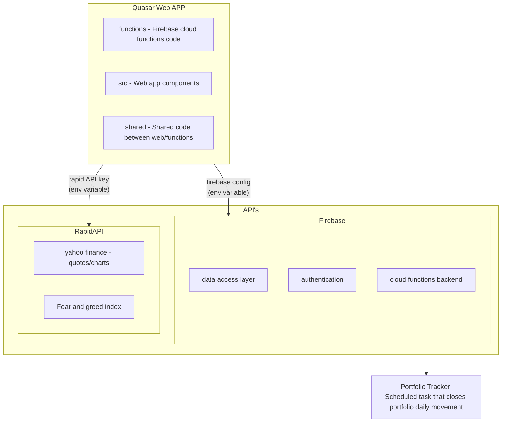

## Getting Started

> You will need to close this repository and hit `npm install` to kick in this flow.

1. Create a `firebase` project https://console.firebase.google.com/ and get firebase API credentials.
2. Create an account in `RapidAPI` https://rapidapi.com/ and get the API key and register to the following apps:

- https://rapidapi.com/apidojo/api/yahoo-finance1/playground/apiendpoint_2c81ebb5-60ab-41e4-8cd2-2056b26e93c2
- https://rapidapi.com/rpi4gx/api/fear-and-greed-index/playground/apiendpoint_042f2700-015a-41a9-aa6b-6c87dd95da0c

3. Create a `.env` file in the root of the project and add the following variables:

```bash
API_KEY=XXX
AUTH_DOMAIN=XXXX
PROJECT_ID=<PROJECT_ID>
STORAGE_BUCKET=<BUCKET>
APP_ID=<APP_ID>
MESSAGING_SENDER_ID=XXX

RAPID_YAHOO_API_KEY=<RAPID_API_KEY>
STOCKS_QUOTE_CACHE_TTL=18000000
```

4. Login with `firebase-cli`.
5. Create firebase secrets for `RAPID_YAHOO_API_KEY` following [this guide](https://dev.to/rajeshkumaravel/google-firebase-functions-setting-and-accessing-environment-variable-1gn2).
6. Deploy you app using `npm run deploy` .

## Github Actions

This projects comes opt-in using `Github` firebase actions implementing:

- `preview/XXXXX` branches will be published into preview version and would be attached with a link to it's PR.
- `main` branch will be published into production version.

In order to make this work, you will need to re-declare each variable defined over your `.env` file as `Github Secrets` in your repository settings.

> For example: https://github.com/myuser/some_repo/settings/secrets/actions

## Project Overview


